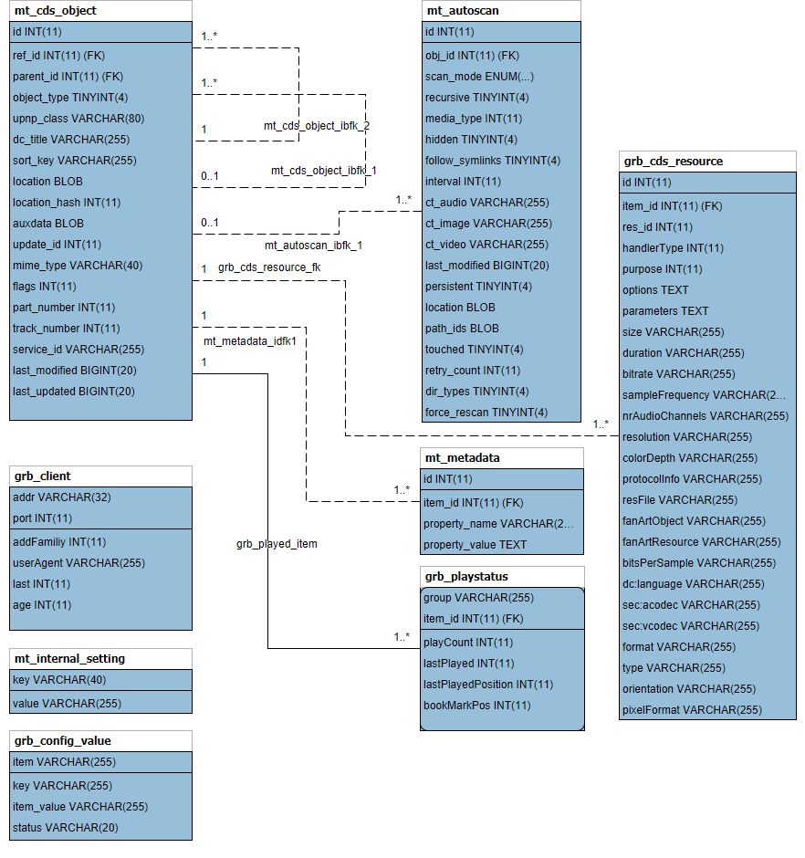

.. index:: Database Schema

Database Schema
===============

The database contains 6 tables.
3 tables ``mt_cds_object`` (for media items or directories), ``mt_metadata`` (like artist or track number) and ``grb_cds_resource`` (like bitrate or image size) store details of the media (audio, video and images) and associated items (like subtitles or album art images).
Table ``mt_autoscan`` maintains data on autoscan directories.
Tables ``mt_internal_setting`` and ``grb_config_value`` store settings (like database version) and configuration values changed via UI.

Modify Schema
=============

- src/database/sql_database.h: Update ``DBVERSION``
- src/database/sqlite3/sqlite3.sql and src/database/mysql/mysql.sql: Modify ``CREATE TABLE`` statements
- src/database/sqlite3/sqlite3-upgrade.xml and src/database/mysql/mysql-upgrade.xml: Add schema update commands
- src/database/sqlite3/sqlite_database.cc and src/database/mysql/mysql_database.cc:
     - Add correct hashy to hashies list (run ``ctest`` to get error on wrong hash)
     - Update hashies[0] for the create scripts (run ``ctest`` to get error on wrong hash)
