.. _gerbera-ui:
.. index:: Web UI

Gerbera UI
==========

The Gerbera application provides a web browser user interface.  When you launch the Gerbera application the system
reports URL to the user interface.  The interface is available for you to maintain your media library in Gerbera.

Enable/Disable
~~~~~~~~~~~~~~

The Gerbera UI is enabled or disabled using the `config.xml` file.

.. code-block:: xml

   <config>
     <server>
       <ui enabled="no" show-tooltips="yes">
         <accounts enabled="no" session-timeout="30">
           <account user="" password=""/>
         </accounts>
       </ui>
     </server>
   </config>

When the Gerbera server starts successfully it reports the location of the web browser user interface

::

    2018-01-28 17:05:28    INFO: The Web UI can be reached by following this link: http://127.0.0.1:49152/

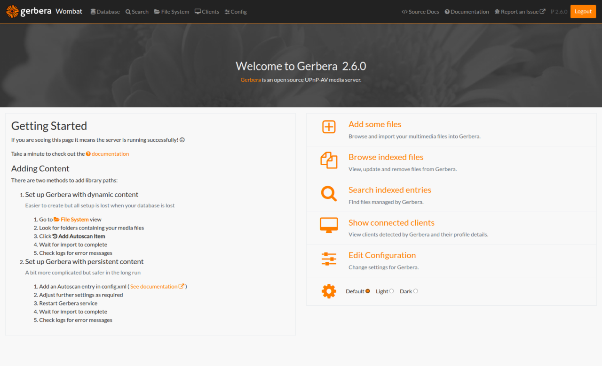

Login/Logout
~~~~~~~~~~~~

When the `accounts` section of the server configuration is enabled you can login to the UI with the associated user and password.

The UI supports entering the **username** and **password** in the top menu.

**Note** The system performs simple encoding of the password sent over HTTP to the Gerbera server.
Do not consider the UI a completely secure data transmission.

.. image:: _static/login-field-entry.png
   :alt: Login username and password
   :target: _static/login-field-entry.png

If you choose to have the `accounts` disabled, then the UI automatically logs in and loads a new user session.

The menu is activated with successful login and you can choose from the following menu options:

The main view offers the same links to the sub pages as the menu. It also displays the statistics of the server's contents.

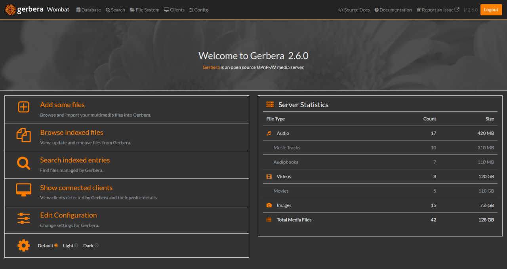

* Home (Gerbera logo or server name)
    *Returns to the start page*
* Database // Browse indexed files
    *Browse the contents of the database without UPnP client*
* Search // Search indexed files
    *Search the contents of the database without UPnP client*
* Filesystem // Add some files
    *Show the filesystem tree of the server to add further contents*
* Clients // Show connected clients
    *Shows all connected clients with details*
* Config // Edit Configuration
    *View and update Gerbera settings*
* Documentation
    *Entry point to these pages*
* Report an Issue
    *Opens URL to Gerbera's GitHub Issues*

Features
~~~~~~~~

The Gerbera web UI has several features to maintain your media.

* Filesystem Items View
* Database Items View
* Search View
* Clients View
* Config View
* Item Operations
* Trail Operations
* Notifications

.. _filesystem-view:

Filesystem View
~~~~~~~~~~~~~~~

The filesystem view is accessible through the `File System` menu item. The filesystem view shows a folder tree
representing the local filesystem.  You can choose folders and items to add to your media library.

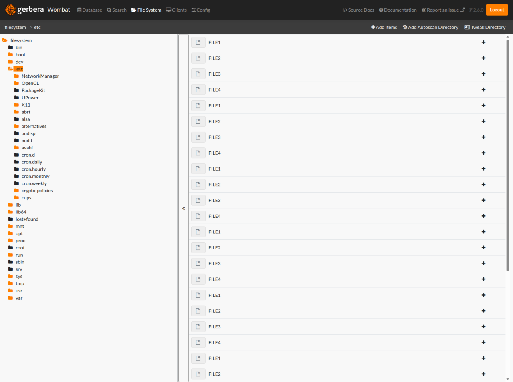

You can add items to the database view, making them accessible to UPNP clients.  A successful addition of a filesystem
item results in that item being indexed and available in the Database view.

If the file is listed in "Database > PC Directory", then Gerbera already knows about it,
and clicking "add" does not do anything.

Database View
~~~~~~~~~~~~~

The database view is accessible through the `Database` menu item.  The view represents the (see :ref:`virtual layout <layout>`)
of your media library.  The database view displays a tree structure generated by the Gerbera `import` mechanism which either uses
a fixed builtin structure or javascript fuctions.  You can customize the database view structure by using the available scripts 
or writing new ones (see :ref:`Scripting <scripting>`).

You can maintain the database by removing items and editing existing items to manually keep your media library up to date.  Be aware that
some changes may be overwritten by the autoscan imports.  On the other hand you can delibrately delete virtual items to allow proper reimport.

List View
---------
The list view offers full access to all modification commands.

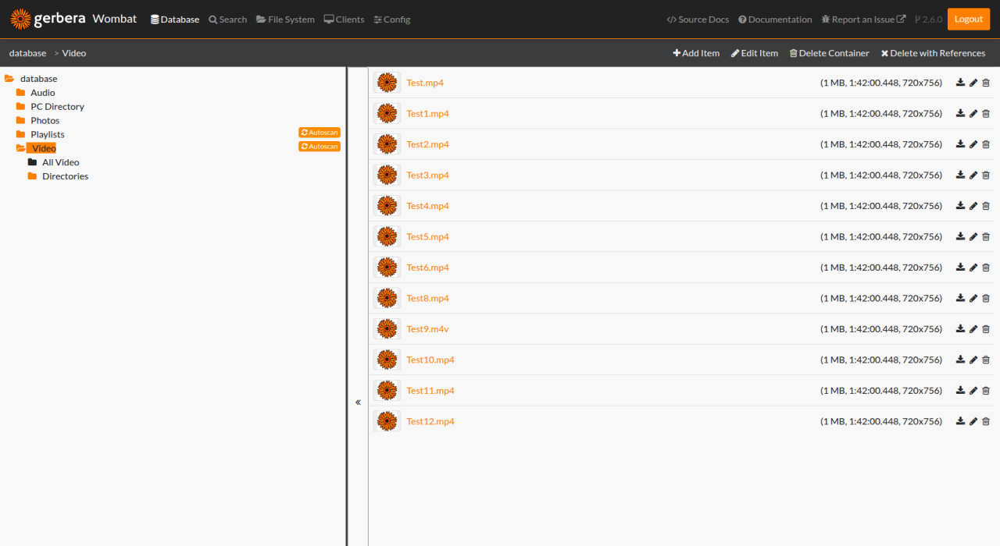

Grid View
---------
The small grid view is designed to display many items on one screen without scrolling. To avoid critical clicks, delete and edit actions are hidden.

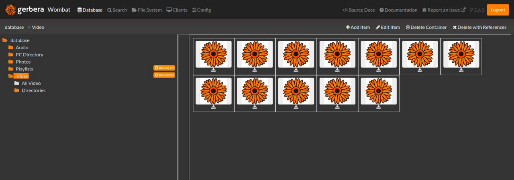

Large Grid View
----------------
The large grid view is designed to display previews on items like images. To avoid critical clicks, delete and edit actions are hidden.

Single Item View
----------------
The single item view is designed to display images. To avoid critical clicks, delete and edit actions are hidden.

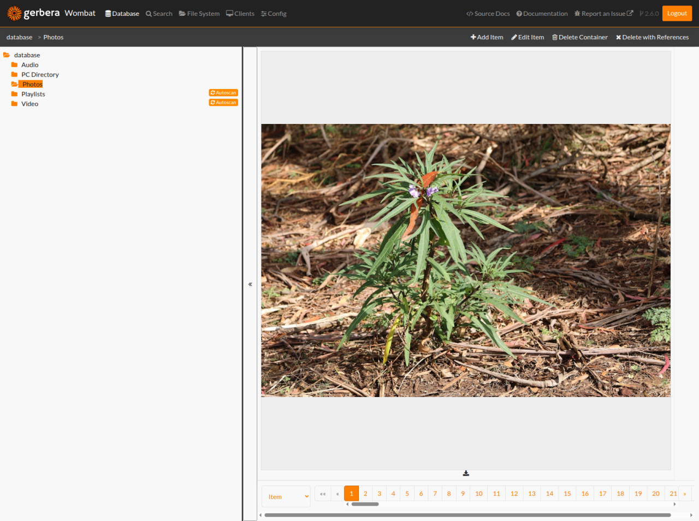

Seach View
~~~~~~~~~~

The search view allows searching the database with upnp search queries like a regular upnp client may do as well

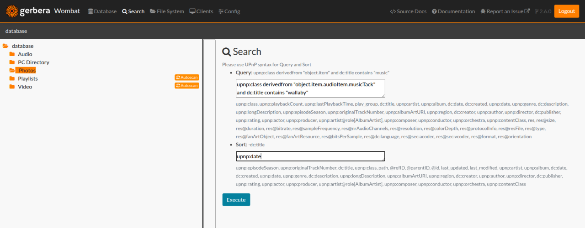

Clients View
~~~~~~~~~~~~

The clients view is accessible through the `Clients` menu item.  The view contains details on all clients that contacted the server.
The second section contains statistics on the items played by the client groups.

.. image:: _static/clients-view_dark.png
   :alt: Clients view in dark view
   :target: _static/clients-view_dark.png

Config View
~~~~~~~~~~~

The config view is accessible through the `Config` menu item.  The view contains the current gerbera settings.

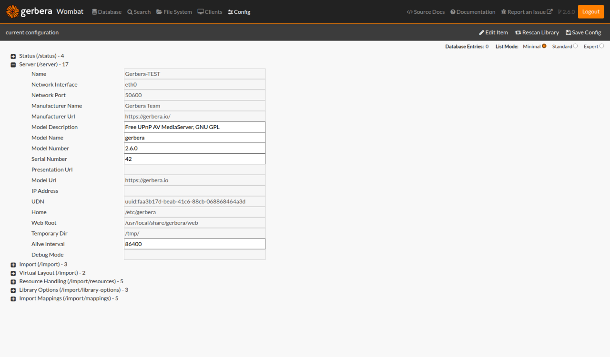

You can switch between three different levels of details. Only *expert* mode gives you all configuration values and modification options.
Be careful when changing values you do not fully understand. The server may fail to restart or become inaccessible.
The new values are stored in Gerbera database and overwrite values from ``config.xml``. If you have broken Gerbera you have to clear the database
or at least clear all entries from the table ``grb_config_value``.

Item Operations
~~~~~~~~~~~~~~~

The items list displays when a virtual item is selected in the `database view` tree.  The UI supports the following item
operations

* Download Item
* Edit Item
* Delete Item

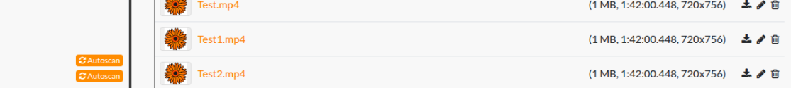

- Downloading the item retrieves the media directly from the Gerbera server.
- Deleting the item removes it from the virtual Database View.
- Editing the item updates the UPNP meta-data for the item.

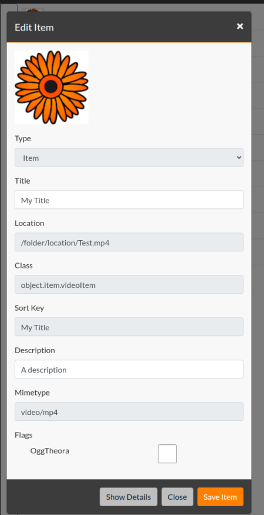

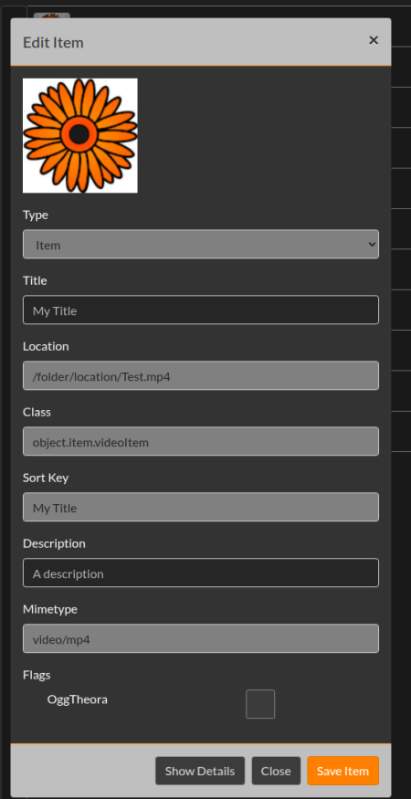

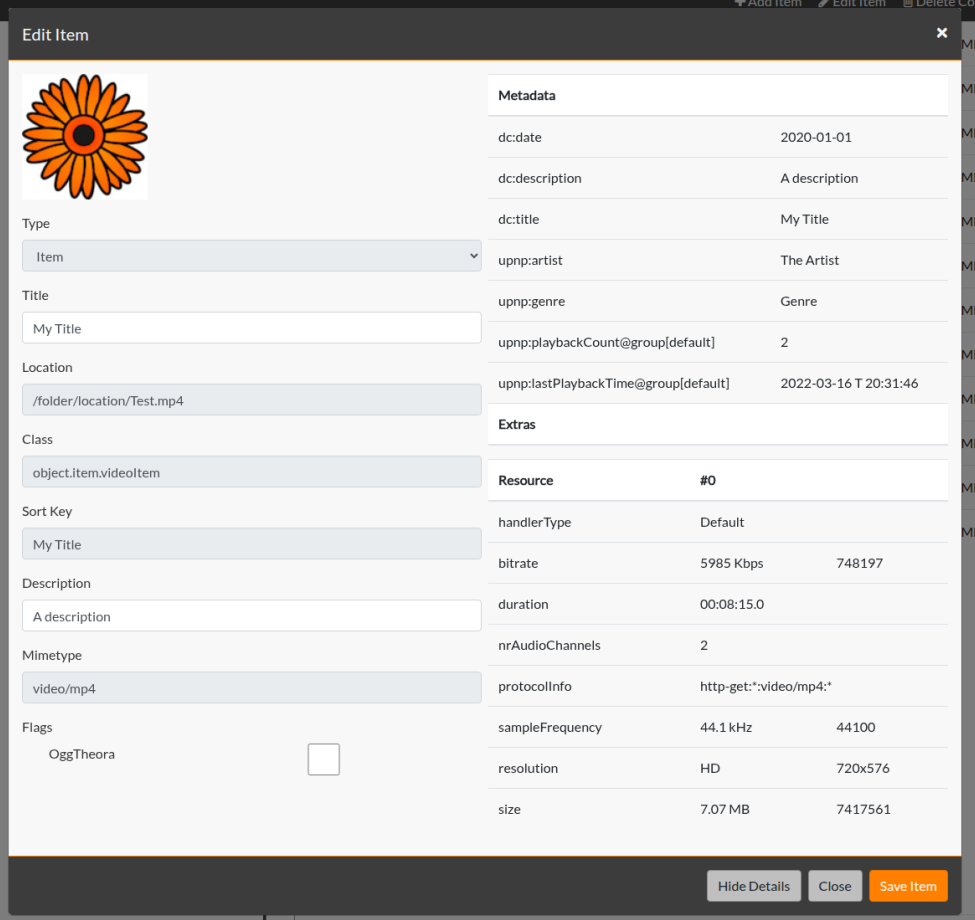

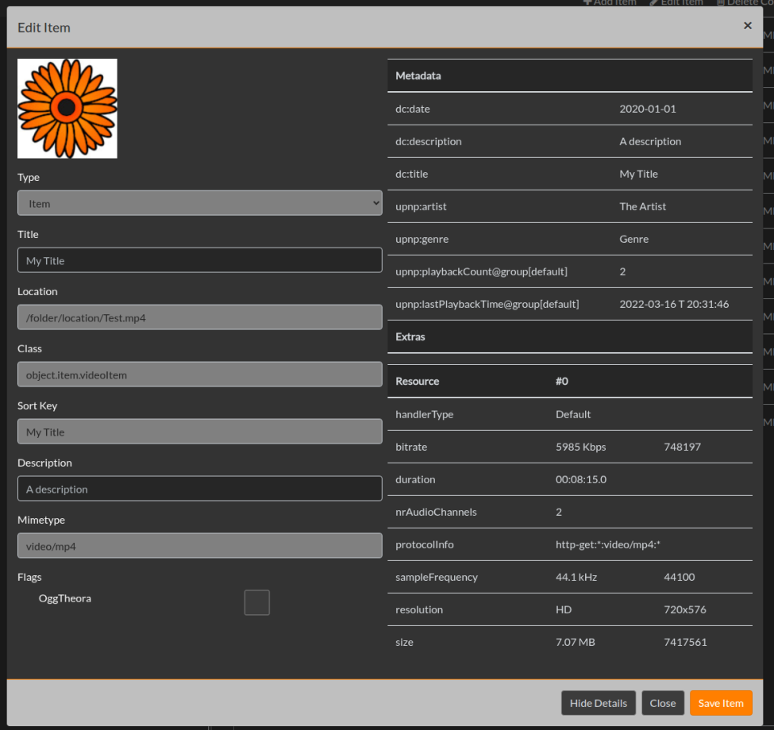

Item operations act upon existing database items.  You can create new custom items using the Gerbera Trail.

PC Directory
------------

When files are added to Gerbera, they first get added to "Database > PC Directory".
After that, *virtual items* are added in "Audio", "Photos" or "Video".
The virtual items reference the entries inside "PC Directory".

When deleting virtual items, only the virtual item itself is deleted.
When deleting an item inside the "PC Directory" folder, all
virtual items referencing this item are deleted.

After deleting an entry in the "PC Directory", Gerbera does not know about
the file anymore. It can be re-added in the "File System" view.

Autoscan configuration forces a reimport of these files after restarting the gerbera server.

.. _autoscan-edit:

Edit Autoscan
-------------

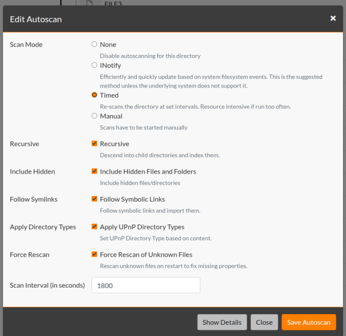

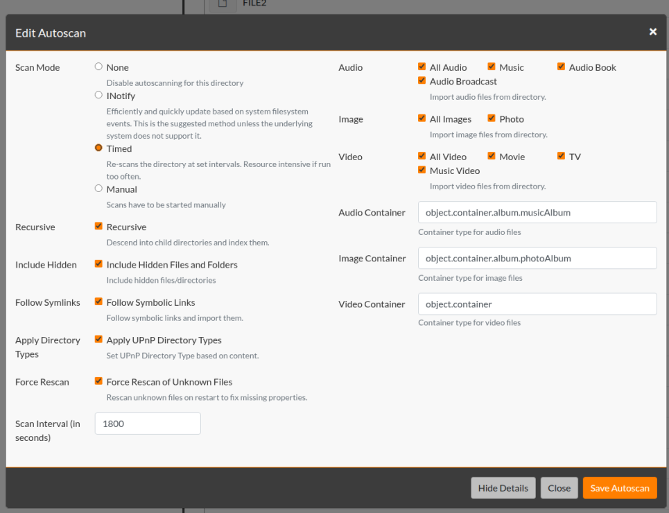

.. _tweak-edit:

Tweak Folder
------------

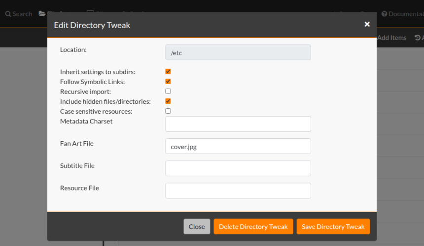

Trail Operations
~~~~~~~~~~~~~~~~

The Gerbera Trail shows the current database/filesystem path and provides a number of operations.

Filesystem View
---------------

* Add Items
    * Add folder and subfolders to database
* Add Autoscan Directory/ Edit Autoscan Item
    * Configure folder as autoscan item
    * Triggers scan of the directory
* Scan Now
    * Triggers immediate scan of the selected directory
* Tweak Directory
    * Set special import properties for folder

Database View
-------------

* Add Item
    * Create Container or Item in Virtual Layout
* Edit Item
    * Change Settings of Container
* Delete Container
    * Delete container and items of container
* Delete with References
    * Delete container, items and all references

Config View
-----------

* Rescan Library
    * Trigger rescanning of all files
* Save Config
    * Save changed entries into database, a restart of gerbera may be necessary to activate the changes
* Clear Saved Config
    * Remove all config changes from the database

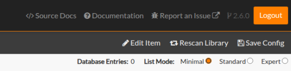

Notifications
~~~~~~~~~~~~~

Gerbera runs all activities asynchronously.  As you add content to the Gerbera database, the server scans and updates the
items based on the media tagging.  The Gerbera server reports busy activities to the UI in the form of 2 message bars.

* Status Message
* Task Message

The status message alerts upon operations to the server.  The server reports success and failure messages to the status
message bar at the bottom of the page.

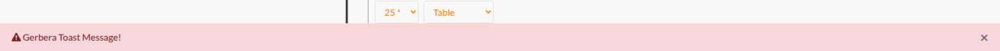

The task message bar is only visible when there is active processing on the Gerbera server.  The active tasks display in
the task message bar at the bottom of the page.

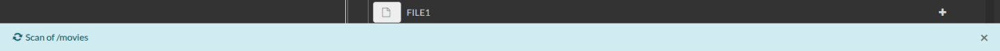
