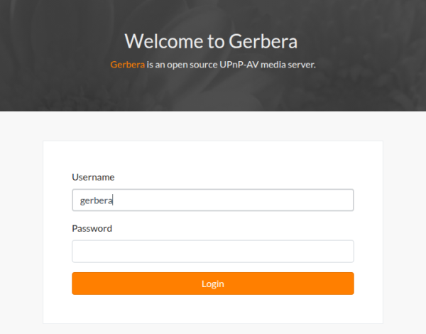

.. _gerbera-ui:
.. index:: Web UI

Gerbera UI
==========

The Gerbera application provides a web browser user interface.  When you launch the Gerbera application the system
reports URL to the user interface.  The interface is available for you to maintain your media library in Gerbera.

Enable/Disable
~~~~~~~~~~~~~~

The Gerbera UI is enabled or disabled using the `config.xml` file.

::

    <config>
      <server>
        <ui enabled="no" show-tooltips="yes">
          <accounts enabled="no" session-timeout="30">
            <account user="" password=""/>
          </accounts>
        </ui>
      </server>
    </config>

When the Gerbera server starts successfully it reports the location of the web browser user interface

::

    2018-01-28 17:05:28    INFO: The Web UI can be reached by following this link: http://127.0.0.1:49152/

Login/Logout
~~~~~~~~~~~~

When the `accounts` section of the server configuration is enabled you can login to the UI with the associated user and password.

The UI supports entering the **username** and **password** in the top menu.

**Note** The system performs simple encoding of the password sent over HTTP to the Gerbera server.
Do not consider the UI a completely secure data transmission.

If you choose to have the `accounts` disabled, then the UI automatically logs in and loads a new user session.

The menu is activated with successful login and you can choose from the following menu options:

.. image:: _static/menubar.png
   :alt: Menubar
   :target: _static/menubar.png

* Home
    *Clears the view*
* Database
    *Loads the Gerbera database*
* Filesystem
    *Loads the local filesystem tree*
* Client
    *Shows all connected clients*
* Config
    *View and update Gerbera settings*
* Report an Issue
    *Opens URL to Gerbera's GitHub Issues*

Features
~~~~~~~~

The Gerbera web UI has several features to maintain your media.

* Filesystem Items View
* Database Items View
* Clients View
* Config View
* Item Operations
* Trail Operations
* Notifications

.. _filesystem-view:

Filesystem View
~~~~~~~~~~~~~~~

The filesystem view is accessible through the `File System` menu item. The filesystem view shows a folder tree
representing the local filesystem.  You can choose folders and items to add to your media library.

.. image:: _static/filesystem-view.png
   :alt: Filesystem view
   :target: _static/filesystem-view.png

You can add items to the database view, making them accessible to UPNP clients.  A successful addition of a filesystem
item results in that item being indexed and available in the Database view.

Database View
~~~~~~~~~~~~~

The database view is accessible through the `Database` menu item.  The view represents the virtual layout of your media
library.  The database view displays a tree structure, generated by the Gerbera `import` scripts.  You can customize the
database view structure by using the available scripts written using javascript.

.. image:: _static/database-view.png
   :alt: Database view
   :target: _static/database-view.png

You can maintain the database view removing items and edit existing items to keep your media library up to date.

Clients View
~~~~~~~~~~~~

The clients view is accessible through the `Clients` menu item.  The view contains details on all clients that contacted the server. 

The clients list is purged when restarting the server.

Config View
~~~~~~~~~~~

The config view is accessible through the `Config` menu item.  The view contains the current gerbera settings.

.. image:: _static/config-view.png
   :alt: Config view
   :target: _static/config-view.png

You can switch between three different levels of details. Only `expert´ mode gives you all config values and modification options.
Be careful when changing values you do not fully understand. The server may fail to restart or become inaccessible.
The new values are stored in Gerbera database and overwrite values from `config.xml`.

Item Operations
~~~~~~~~~~~~~~~

The items list displays when a virtual item is selected in the `database view` tree.  The UI supports the following item
operations

* Download Item
* Edit Item
* Delete Item

.. image:: _static/item-operations.png
   :alt: Item operations
   :target: _static/item-operations.png

- Downloading the item retrieves the media directly from the Gerbera server.
- Editing the item updates the UPNP meta-data for the item.
- Deleting the item removes it from the virtual Database View

Item operations act upon existing database items.  You can create new custom items using the Gerbera Trail.

Trail Operations
~~~~~~~~~~~~~~~~

The Gerbera Trail shows the current database/filesystem path and provides a number of operations.

* Add New Item
* Add Autoscan
* Add Tweak
* Edit Container
* Delete Container
* Delete All

.. image:: _static/trail-operations.png
   :alt: Trail operations
   :target: _static/trail-operations.png

.. image:: _static/trail-fs-operations.png
   :alt: Trail operations in Filesystem view
   :target: _static/trail-fs-operations.png

.. image:: _static/trail-config-operations.png
   :alt: Trail operations in Config view
   :target: _static/trail-config-operations.png

The Gerbera Trail supports adding virtual item types including containers, items, internal urls, external urls.
Adding an `autoscan` triggers the scan of a complete directory.  Autoscan adds valid mime-type items to the Gerbera database.
Edit and Delete of container removes the container.  The `Delete All` icon removes a container and all sub-items from the
Gerbera database.

Notifications
~~~~~~~~~~~~~

Gerbera runs all activities asynchronously.  As you add content to the Gerbera database, the server scans and updates the
items based on the media tagging.  The Gerbera server reports busy activities to the UI in the form of 2 message bars.

* Status Message
* Task Message

The status message alerts upon operations to the server.  The server reports success and failure messages to the status
message bar at the bottom of the page.

.. image:: _static/toast-message.png
   :alt: Toast message
   :target: _static/toast-message.png

The task message bar is only visible when there is active processing on the Gerbera server.  The active tasks display in
the task message bar at the top of the page.

.. image:: _static/task-message.png
   :alt: Task message
   :target: _static/task-message.png

